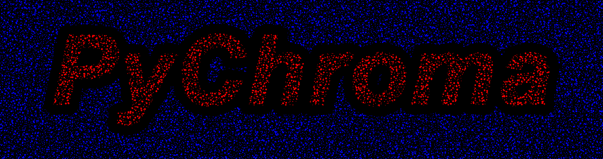
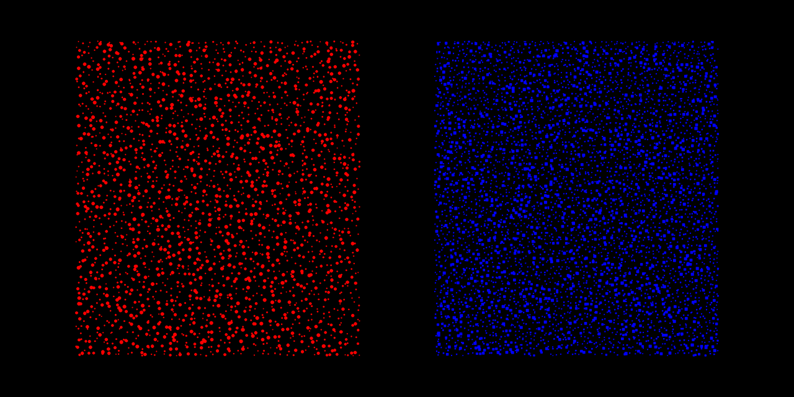
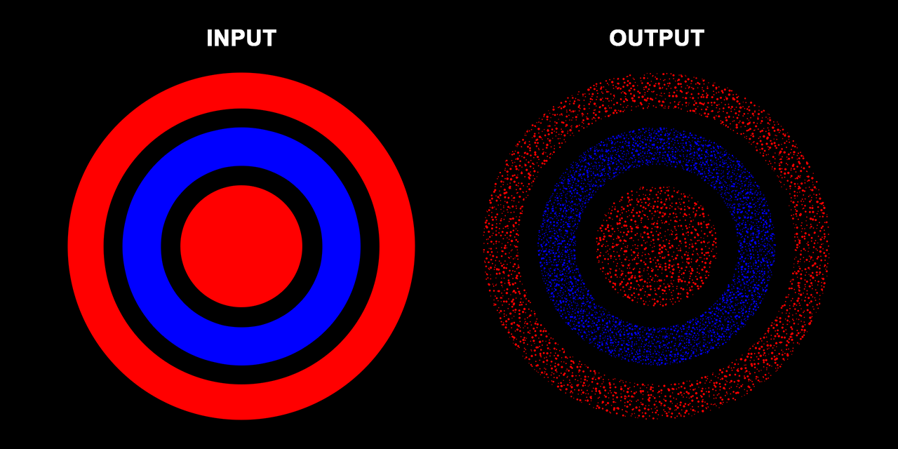
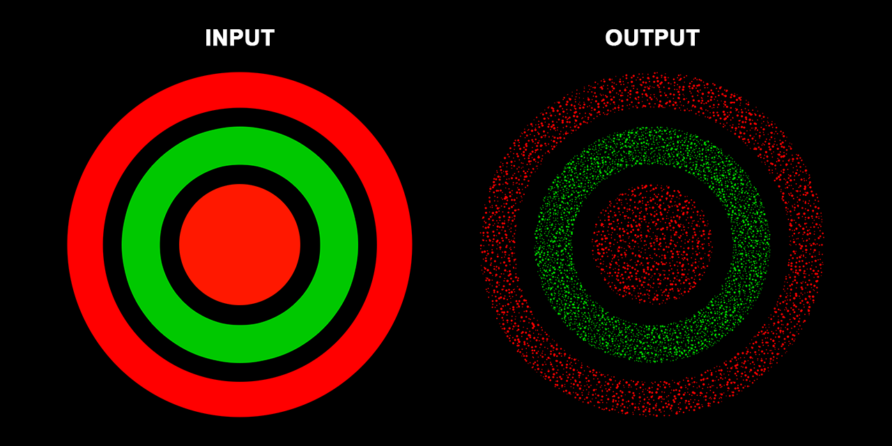
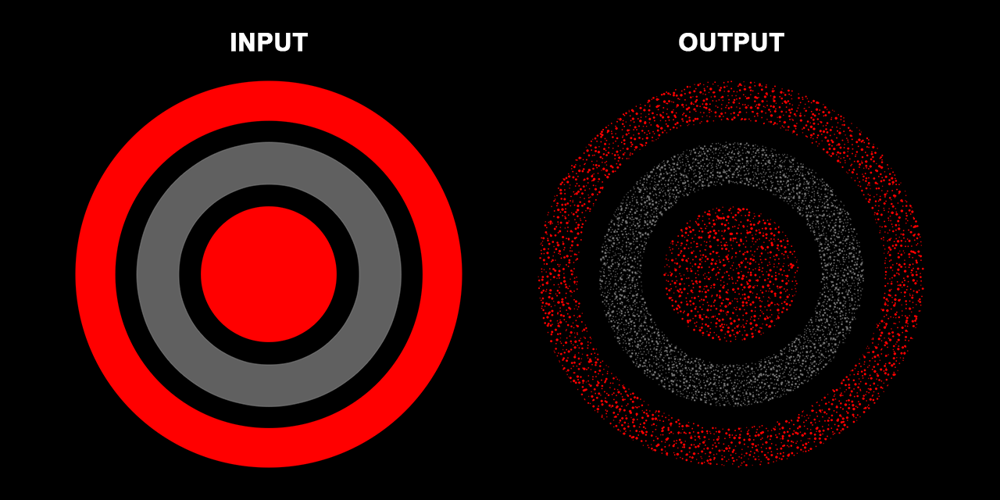
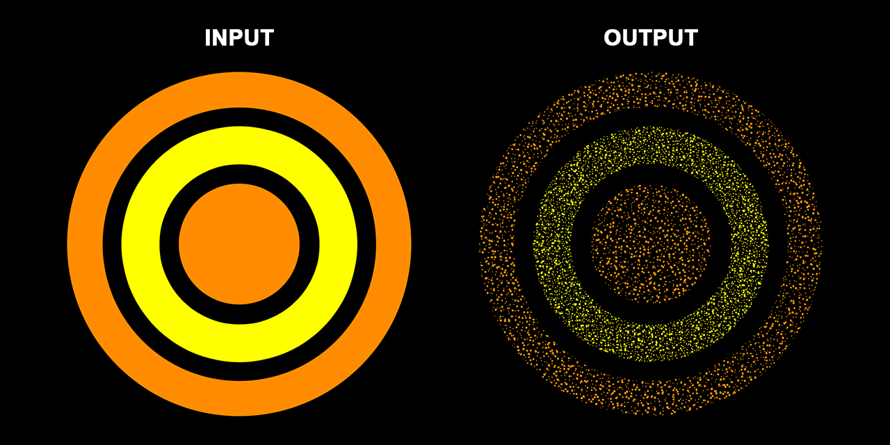

# PyChroma

<figure>
 
</figure>

**A Python package enabling users to transform existing images into dot-based chromostereopsis output, tractable for use within illusion research.**

## What is chromostereopsis?
**Chromostereopsis** refers to the visual illusion whereby a perception of depth is created upon viewing a combination of certain colours on an achromatic background in a two-dimensional image. The strength of this optical illusion seems to vary across the general human population, where some individuals report perceiving it strongly, with others not perceiving it to any noticeable degree.

The prototypical form of chromostereopsis is induced by red-blue colours on a black background. In the image below, most individuals will see the red shape as "popping out" in front of the blue shape. This is called *positive* chromostereopsis. Whereas, others may see the opposite effect: *negative* chromostereopsis creating a perception of the blue shape floating ahead of the red shape.

<figure>
 
</figure>

## What does this package do?
This package has been designed to receive input from an existing image (of the user's choice!) containing colour blocks using two different colours on a black background. These colour blocks will be replaced by a dot pattern, comprising both **small** and **large** dots, programmed to give rise to chromostereopsis. The *exact* configuration of this dot pattern output is stochastic, generated by a random seed function. Overall, depth perception in PyChroma results from controlled parameters affecting the properties of a dot-based illusion stimulus.

Information regarding the parameters included in PyChroma can be found towards the bottom of this README.

## Installation
Install directly from this GitHub repository in the Python terminal:

```python
pip install https://github.com/OliverACollins/PyChroma/zipball/main
```

## Chromostereopsis illusions included in this package
Here, you can find the four illusion functions included in PyChroma, which can be generated either in the CLI or directly within Python scripts.

> [!NOTE]
> If you own prescription glasses, wearing your glasses may enhance the stereoptic effect of these illusions! Although, within this README, the examples below may not produce the illusion expected from chromostereopsis due to their relatively small sizes.

### Red-blue

<figure>
 
</figure>

To ensure the illusion generator detects the red, blue, and black colours from the input image, it is recommended that your input uses the following colour codes:
- Red: #FF0000 / (255, 0, 0)
- Blue: #0000FF / (0, 0, 255)
- Black: #000000 / (0, 0, 0)


```powershell
PyChroma red-blue
```

```python
from importlib.resources import files
from PIL import Image
from src.scripts.red_blue import generate

red_dots = dict(
    radius=1.8,
    density=10,
    jitter=0.65,
    ratio=0.55,
    shape="circle",
)

blue_dots = dict(
    radius=1.5,
    density=7,
    jitter=0.25,
    ratio=0.75,
    shape="square",
)

# DEFAULT INPUT
img = Image.open(
    files("src.scripts.default_input") / "redblue.png"
).convert("RGB")

# USE THIS CODE INSTEAD FOR CUSTOM INPUT
#img = Image.open(
#    r"[FILEPATH]"
#).convert("RGB")

generate(
    img=img,
    output_path="chromostereopsis.png",
    red_dots=red_dots,
    blue_dots=blue_dots,
)
```

### Red-green

<figure>
 
</figure>

To ensure the illusion generator detects the red, green, and black colours from the input image, it is recommended that your input uses the following colour codes:
- Red: #FF0000 / (255, 0, 0)
- Green: #00C800 / (0, 200, 0)
- Black: #000000 / (0, 0, 0)

```powershell
PyChroma red-green
```

```python
from importlib.resources import files
from PIL import Image
from src.scripts.red_green import generate

red_dots = dict(
    radius=1.8,
    density=10,
    jitter=0.65,
    ratio=0.55,
    shape="circle",
)

green_dots = dict(
    radius=1.5,
    density=7,
    jitter=0.25,
    ratio=0.75,
    shape="square",
)

# DEFAULT INPUT
img = Image.open(
    files("src.scripts.default_input") / "redgreen.png"
).convert("RGB")

# USE THIS CODE INSTEAD FOR CUSTOM INPUT
#img = Image.open(
#    r"[FILEPATH]"
#).convert("RGB")

generate(
    img=img,
    output_path="chromostereopsis.png",
    red_dots=red_dots,
    green_dots=green_dots,
)
```

### Red-grey

<figure>
 
</figure>

To ensure the illusion generator detects the red, grey, and black colours from the input image, it is recommended that your input uses the following colour codes:
- Red: #FF0000 / (255, 0, 0)
- Grey: #606060 / (96, 96, 96)
- Black: #000000 / (0, 0, 0)

```powershell
PyChroma red-grey
```

```python
from importlib.resources import files
from PIL import Image
from src.scripts.red_grey import generate

red_dots = dict(
    radius=1.8,
    density=10,
    jitter=0.65,
    ratio=0.55,
    shape="circle",
)

grey_dots = dict(
    radius=1.5,
    density=7,
    jitter=0.25,
    ratio=0.75,
    shape="square",
)

# DEFAULT INPUT
img = Image.open(
    files("src.scripts.default_input") / "redgrey.png"
).convert("RGB")

# USE THIS CODE INSTEAD FOR CUSTOM INPUT
#img = Image.open(
#    r"[FILEPATH]"
#).convert("RGB")

generate(
    img=img,
    output_path="chromostereopsis.png",
    red_dots=red_dots,
    grey_dots=grey_dots,
)
```

### Flexible

<figure>
 
</figure>

This function, through specifying HEX codes, enables you to choose two colours to replace with the dot-based pattern.

```powershell
PyChroma flexible
```

```python
from importlib.resources import files
from PIL import Image
from src.scripts.flexible import generate

dots1 = dict(
    radius=1.8,
    density=10,
    jitter=0.65,
    ratio=0.55,
    shape="circle",
)

dots2 = dict(
    radius=1.5,
    density=7,
    jitter=0.25,
    ratio=0.75,
    shape="square",
)

# DEFAULT INPUT
img = Image.open(
    files("src.scripts.default_input") / "orangeyellow.png"
).convert("RGB")

# USE THIS CODE INSTEAD FOR CUSTOM INPUT
#img = Image.open(
#    r"[FILEPATH]"
#).convert("RGB")

generate(
    img=img,
    output_path="chromostereopsis.png",
    dots1=dots1,
    dots2=dots2,
    colour1="#FF8C00",
    colour2="#FFFF00"
)
```

## Parameters
To view the parameters included for each chromostereopsis illusion function, simply use the `--help` option in the Python terminal to read a brief description of what each argument does and its default setting:

```powershell
PyChroma red-blue --help
```

Parameters can be specified in the following manner:

```powershell
PyChroma red-blue --red_radius 2.5 --red_ratio 0.45 --blue_radius 1.7 --blue_ratio 0.85
```

### Parameters included
> [!NOTE]
> The parameters below do NOT scale according to the input image's dimensions, so tweaking these values may be necessary to produce the desired effects of chromostereopsis.

- `--input`: the path of the input image (from one's device). By default, an image of a colour-filled target (seen in the pictorial examples above - tailored to each illusion script) acts as the user's input. You MUST specify the file extension of the image (e.g., .png, .jpg, .tiff, .pdf)
- `--save`: the path of the output image (to save to one's device). Again, you MUST specify the output's file extension

**All four** illusions contain commands allowing the user to adjust variables relating to the coloured dots. Below, `{prefix}` acts as a placeholder for the specified colour:

- `--{prefix}_radius`: adjust the radius of the coloured dots. This argument stochastically controls the size of both the small and large dots together. It is important to note that, below a certain threshold (radius < ~1), dot count will be reduced non-linearly
- `--{prefix}_density`: modify the concentration of the coloured dots within the corresponding colour block. A greater density can be produced by lowering the value of this argument
- `--{prefix}_jitter`: control the jitter of the coloured dots. This argument adds additional stochastic noise to the position of the dots: a value of 0 corresponds to no noise, with greater values creating an increasingly chaotic dot pattern
- `--{prefix}_ratio`: manipulate the ratio of small:large coloured dots. Here, a value of 0 means that no small dots are drawn, whereas a value of 1 means that *only* small dots are drawn
- `--{prefix}_shape`: change the shape of each coloured dot to either a circle or a square

For the "**Flexible**" function, there are unique arguments that can be specified:

- `--colour1`: specify one HEX colour (e.g., `"#FF8C00"`), which will be converted to an RGB value
- `--colour2`: specify another HEX colour (e.g., `"#FFFF00"`), which will be converted to an RGB value
- `--tolerance`: adjust the maximum allowed colour distance away from the target HEX colours, computed in RGB colour space. The greater the value, the more liberal the colour discrimination will be

*If any issues occur with this Python package, please open an [Issue](https://github.com/OliverACollins/PyChroma/issues) so that any problems highlighted can be addressed. Thank you!*